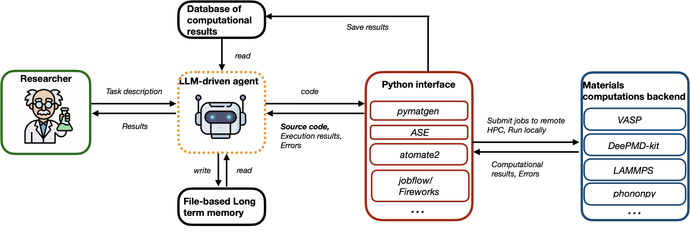

# MatClaw

An autonomous code-first LLM agent for end-to-end materials computations. Built on HuggingFace's [smolagents](https://github.com/huggingface/smolagents), MatClaw writes and executes Python directly in a sandboxed interpreter, composing any installed domain library (pymatgen, ASE, atomate2, jobflow, DeePMD-kit) to orchestrate multi-code workflows on remote HPC clusters without predefined tool functions.

> **Looking for examples?** The [`release`](https://github.com/cz2014/MatClaw/tree/release) branch contains demo scripts and complete workspace outputs from the paper demonstrations.

## Demo

MoS2 lattice relaxation on Perlmutter — from natural language task to VASP results in a single command:

<p align="center">
  <video src="https://github.com/user-attachments/assets/d81f1400-e43c-4f2a-9a52-62bd1a1ad66e" controls width="700"></video>
</p>

## How It Works

<p align="center">
  
</p>

The researcher provides a task description in natural language. The agent generates and executes Python code through a sandboxed interpreter, calling domain libraries to manipulate structures, submit jobs to remote HPC clusters (VASP, DeePMD-kit, LAMMPS, etc.), and analyze results. The agent reads execution outputs and errors, self-corrects, and iterates until the task is complete.

**Key design choices:**

- **Code-first execution.** The agent's action space is executable Python, not a fixed set of tool-function calls. This supports composition, branching, loops, and error recovery naturally.
- **Four-layer memory.** A persistent memory architecture — in-context working memory, episodic conversation history, a semantic experience log, and an external database of computational results — prevents the progressive forgetting that derails long-running workflows.
- **Retrieval-augmented generation.** Structure-aware code chunking with BM25 retrieval raises per-step API accuracy to ~99%, providing the reliability floor that multi-step workflows require.
- **Guided autonomy.** The most productive collaboration model is not full autonomy but guided autonomy: the researcher provides high-level domain constraints and literature pointers, and the agent handles workflow orchestration, error recovery, and iterative refinement.

## Install

```bash
pip install -e .
```

## Quick Start

1. Set your LLM API key:

```bash
export OPENAI_API_KEY=...       # for GPT models
# or
export GEMINI_API_KEY=...       # for Gemini models
# or
export CLAUDE_API_KEY=...       # for Claude models
```

2. Configure the default provider in `config/llm_config.yaml` (edit `default_provider`).

3. Run the agent from your workspace directory:

```bash
cd ~/Work/matclaw_runs/my_task/
matclaw run --task task.txt --project perlmutter
```

Or resume a crashed run:

```bash
matclaw run --resume
```

## HPC Setup

MatClaw submits computational jobs to remote HPC clusters via [jobflow-remote](https://github.com/Matgenix/jobflow-remote). Each cluster needs:

1. A jobflow-remote project YAML in `~/.jfremote/` (see jobflow-remote docs)
2. SSH key access to the cluster
3. A running jobflow-remote runner daemon: `jf -p <project> runner run`

Multiple clusters can run simultaneously. Pass `project="<name>"` to `main()` to select the target cluster.

## RAG Corpus

Build retrieval indices for documentation-augmented generation:

```bash
# Install Node.js dependency for tree-sitter chunking
cd scripts && npm install && cd ..

# Build default corpus (code-chunk method, 800 tokens, BM25)
python scripts/build_corpus.py
```

RAG is configured via `config/rag_config.yaml`. Set `enabled: true/false` to control whether the `rag_search` tool is available to the agent.

### Rebuilding the RAG Corpus

Pre-built retrieval indices ship in `data/corpus/` and work out of the box. Rebuild if your installed package versions differ from those used to build the shipped index (e.g., a newer pymatgen with added/changed APIs):

```bash
# Rebuild for specific packages:
python scripts/build_corpus.py --packages pymatgen atomate2

# Rebuild all registered packages:
python scripts/build_corpus.py
```

This copies source from your installed packages into `data/sources/` and rebuilds the BM25 index in `data/corpus/`.

To index a new package not yet in the corpus:

**1. Build the index:**

```bash
# For an installed Python package:
python scripts/build_corpus.py --packages newpackage

# For markdown documentation:
python scripts/build_corpus.py --docs-dir data/docs/newpackage --software newpackage
```

**2. Register in `config/rag_config.yaml`:**

```yaml
corpus:
  newpackage:
    retriever_method: bm25
    description: "newpackage source code (Python)"
```

The agent will automatically see the new corpus in its `rag_search` tool and can query it with `software=["newpackage"]`.

## License

MIT
